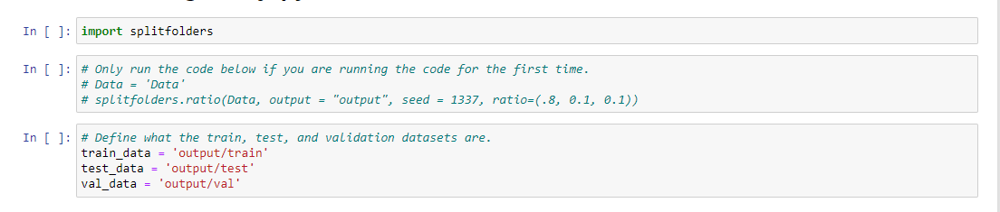

# Mask-Finder
An application that lets the user know whether or not they are wearing a mask.

---------------------------------
## Background

With lockdowns being lifted, businesses returning to their physical stores and offices, schools reopening, indoor dining resuming at greater numbers, and folks just looking forward to some sense of normalcy, wearing masks still remain part of continued efforts to ensure the safety and well being of our citizenry. 

As part of continued efforts to combat COVID-19, we've created an application that will allow users to detect whether or not someone is wearing a mask. 

For example, one purpose of this application is to help establishments monitor whether their customers are abiding by their Covid Safety Guidelines. 

This could help businesses keep their employees and customers safe, without having to use their employees time and resources to track down those who are not wearing a mask within their establishment.  This will save businesses money in the long run and promote public health safety, which remains a priority! 

Our application will also capture a live photo, process the image, and notify the user if the person is wearing a mask or not. 

------------------------------
## Mission
 
To provide users with a data source that will help detect and identify whether a face mask is worn or not.

-----------------------------

## Technologies

* Javascript/HTML/CSS
* Python 3.6.12
* Flask 
* Pandas 
* Split-folder
* Opencv
* TensorFlow 2.4.1
* Keras 
* NumPy 

--------------------------------
## Data: 
* Main Dataset (download from data section): https://www.ncbi.nlm.nih.gov/pmc/articles/PMC7775036/

* Other data sources:
https://www.kaggle.com/andrewmvd/face-mask-detection

* https://www.worldometers.info/coronavirus/

-------------------------------
## Data Cleaning / Merging Files 

Within the output directory contains the images that were used for training the `face.h5` model. The images were split into three categories(test, train, and validation) along with their subcategories(mask, and no mask).

This was done through the python package splitfolders, splitting the images from the `Data` directory.

The different directories are set to variables and are primed for training.
 
-----------------------------
## Model training
There were two different approaches used in training the model. The first approach was to create a new model from scratch. The latter is to further train a preexisting model. Between the two methods the one used was a pretrained vgg19 model.

-----------------------------
## Coronavirus Insights: Learn more about why you should wear masks!!
#### Tableau Visualization

* Step 1 Extract (See Data_Visualization branch)

*  Extracted coronavirus data from the website : [WorldometersLink](https://www.worldometers.info/coronavirus/)
*  Data Source Credit: Worldometers.info

* Step 2 Transformation (See Data_Visualization branch)

* Cleaned up the data on jupyetr notebook using pandas and created a final csv.
* Utlized pandas, splinter for the extraction and cleaning up process

* Step 3 Loading (See Data_Visualization branch)

* Loaded cleaned up csv data file into Tableau.

* Step 4: Data Analysis using Tableau

* Tableau Visualization: [Tableau Link](https://public.tableau.com/views/Book2_16148141384700/Story1?:language=en&:display_count=y&:origin=viz_share_link)
* In this visualization, utilized the coronavirus dataset to analyze the countries vs the average total cases, total deaths total testing etc.

-----------------------------
## Webpages

HTML/CSS utilized to create the front-end pages to display the data and info in a user friendly view.

---------------------------------
## Heroku

A hope for the app is to be deployed to Heroku. <!-- To look at the app use the this link:  (https://mask-finder.herokuapp.com/) ???  -->

While this is being done you can try the app for yourself. 

---------------------------
## Future Versions

As we look to continuously improve, our future versions may seek to:

1. Further explore whethere a mask if worn, is work effectively or not.
2. Further training the current model to differentiate beards from masks.
3. Have the model categorize the faces through a live feed.
4. Have the web browser take the image instead of the script. -> Implementing more javascript.
5. Continuously take in feedback and update our website based on suggestions from our users.
6. Other noted facial recognition systems misidentify people of color more often than white people, according to a U.S. government study released on Thursday that
   is likely to increase skepticism of technology widely used by law enforcement agencies. 
   see link for more information
   The study also found that African-American females are more likely to be misidentified in “one-to-many” matching, which can be used for identification of a     
   person of interest in a criminal investigation.
   ( https://www.reuters.com/article/us-usa-crime-face/u-s-government-study-finds-racial-bias-in-facial-recognition-tools-idUSKBN1YN2V1 )

### Stay tuned!!
-----------

-------------------------------------
## Team Members 

* Joseph Atemkuh - Programmer/ Analyst
* Delia Hellander - Programmer/ Analyst
* Kevin Lam - Programmer/ Analyst
* Sherin Mattappallil - Programmer/ Analyst
* Buddy Slater - Programmer/ Analyst
* Jessy Thomas - Programmer/ Analyst

